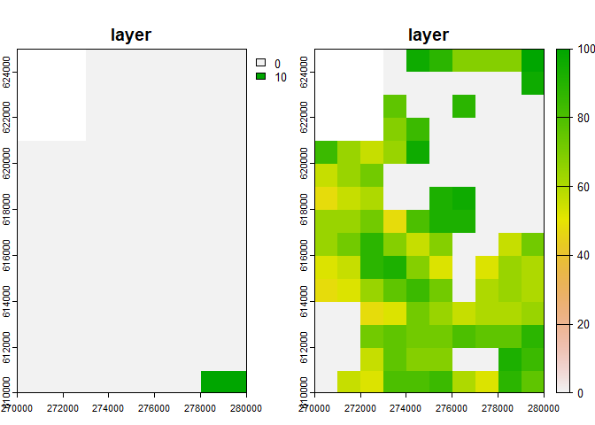
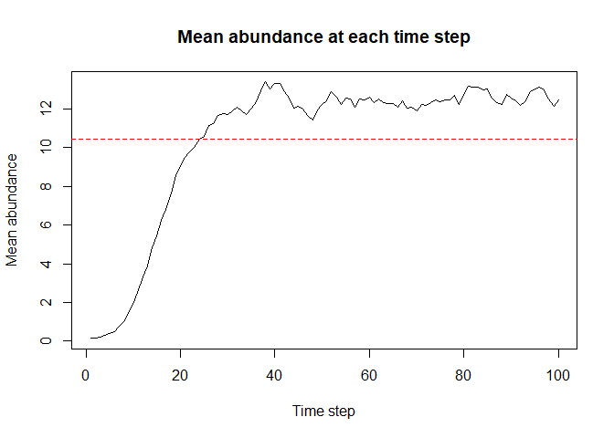

# rangr

<!-- badges: start -->

[](https://github.com/ropensci/software-review/issues/595)
[](https://www.repostatus.org/#active)
[](https://github.com/ropensci/rangr/actions/workflows/R-CMD-check.yaml)[](https://codecov.io/gh/ropensci/rangr)[](https://zenodo.org/doi/10.5281/zenodo.10569367)

<!-- badges: end -->

The **rangr** package is designed to simulate a species range dynamics.
This new tool mimics the essential processes that shape population
numbers and spatial distribution: local dynamics and dispersal.
Simulations can be run in a spatially explicit and dynamic environment,
facilitating population projections in response to climate or land-use
changes. By using different sampling schemes and observational error
distributions, the structure of the original survey data can be
reproduced, or pure random sampling can be mimicked.

The study is supported by the National Science Centre, Poland, grant no.
2018/29/B/NZ8/00066 and the Poznań Supercomputing and Networking Centre
(grant no. 403).

# Installation

## Released version

Not released yet, but we’re working on it.

## Development version

You can install the development version from R-universe or GitHub with:

``` r
install.packages("rangr", repos = "https://ropensci.r-universe.dev")
# or
devtools::install_github("ropensci/rangr")
```

# Basic simulation

Here’s an example of how to use the `rangr` package.

## Input maps

Example maps available in rangr:

- `n1_small.tif`
- `n1_big.tif`
- `K_small.tif`
- `K_small_changing.tif`
- `K_big.tif`

Note that the input maps must be in the geodetic (i.e. Cartesian)
coordinate system. You can find additional information about these data
sets in help files:

``` r
library(rangr)

?n1_small.tif
?K_small.tif
```

Two of the available datasets, `n1_small.tif` and `K_small.tif`,
represent the abundance of a virtual species at the starting point of a
simulation and the carrying capacity of the environment, respectively.
Both of these objects refer to the same relatively small area, so they
are ideal for demonstrating the usage of the package. To view these maps
and their dimensions, you can use the following commands:

``` r
library(terra)
#> terra 1.7.55

n1_small <- rast(system.file("input_maps/n1_small.tif", package = "rangr"))
K_small <-  rast(system.file("input_maps/K_small.tif", package = "rangr"))
```

You can also use the `plot` function from the `terra` package to
visualize these maps:

``` r
plot(c(n1_small, K_small))
```



## Initialise

To create a `sim_data` object containing the necessary information to
run a simulation, use the `initialise()` function. For example:

``` r
sim_data_01 <- initialise(
  n1_map = n1_small,
  K_map = K_small,
  r = log(2),
  rate = 1 / 1e3
)
```

Here, we set the intrinsic population growth rate to `log(2)` and the
rate parameter that is related to the kernel function describing
dispersal to `1/1e3`.

To see the summary of the `sim_data` object:

``` r
summary(sim_data_01)
#> Summary of sim_data object
#> 
#> n1 map summary: 
#>    Min. 1st Qu.  Median    Mean 3rd Qu.    Max.    NA's 
#>  0.0000  0.0000  0.0000  0.1449  0.0000 10.0000      12 
#> 
#> Carrying capacity map summary: 
#>    Min. 1st Qu.  Median    Mean 3rd Qu.    Max.    NA's 
#>    0.00    0.00   56.00   44.84   72.00  100.00      12 
#>                       
#> growth        gompertz
#> r               0.6931
#> A                    -
#> kernel_fun        rexp
#> dens_dep           K2N
#> border       absorbing
#> max_dist          2000
#> changing_env     FALSE
#> dlist             TRUE
```

## Simulation

To run a simulation, use the `sim()` function, which takes a `sim_data`
object and the specified number of time steps as input parameters. For
example:

``` r
sim_result_01 <- sim(obj = sim_data_01, time = 100)
```

To see the summary of the `sim_result_01` object:

``` r
summary(sim_result_01)
```



    #> Summary of sim_results object
    #> 
    #> Simulation summary: 
    #>                     
    #> simulated time   100
    #> extinction     FALSE
    #> 
    #> Abundances summary: 
    #>    Min. 1st Qu.  Median    Mean 3rd Qu.    Max.    NA's 
    #>    0.00    0.00   12.00   10.45   19.00   54.00    1200

Note that this is a simple example and there are many more parameters
that can be set for `initialise()` and `sim()`. See the documentation
for the `rangr` package for more information.

## Visualisation

You can use `rangr` to visualise selected time steps from the
simulation. The `plot()` method is used to generate the plot. Here’s an
example:

``` r
# generate visualisation
plot(sim_result_01,
  time_points = c(1, 10, 25, 50),
  template = sim_data_01$K_map
)
```


    #> class       : SpatRaster 
    #> dimensions  : 15, 10, 4  (nrow, ncol, nlyr)
    #> resolution  : 1000, 1000  (x, y)
    #> extent      : 270000, 280000, 610000, 625000  (xmin, xmax, ymin, ymax)
    #> coord. ref. : ETRS89 / Poland CS92 
    #> source(s)   : memory
    #> names       : t_1, t_10, t_25, t_50 
    #> min values  :   0,    0,    0,    0 
    #> max values  :  10,   19,   27,   36

You can adjust the `breaks` parameter to get more breaks on the
colorscale:

``` r
# generate visualisation with more breaks
plot(sim_result_01,
  time_points = c(1, 10, 25, 50),
  breaks = seq(0, max(sim_result_01$N_map + 5, na.rm = TRUE), by = 5),
  template = sim_data_01$K_map
)
```


    #> class       : SpatRaster 
    #> dimensions  : 15, 10, 4  (nrow, ncol, nlyr)
    #> resolution  : 1000, 1000  (x, y)
    #> extent      : 270000, 280000, 610000, 625000  (xmin, xmax, ymin, ymax)
    #> coord. ref. : ETRS89 / Poland CS92 
    #> source(s)   : memory
    #> names       : t_1, t_10, t_25, t_50 
    #> min values  :   0,    0,    0,    0 
    #> max values  :  10,   19,   27,   36

If you prefer working on raster you can also transform any `sim_result`
object into `SpatRaster` using `to_rast()` function:

``` r
# raster construction
my_rast <- to_rast(
  sim_result_01,
  time_points = 1:sim_result_01$simulated_time,
  template = sim_data_01$K_map
)

# print raster
print(my_rast)
#> class       : SpatRaster 
#> dimensions  : 15, 10, 100  (nrow, ncol, nlyr)
#> resolution  : 1000, 1000  (x, y)
#> extent      : 270000, 280000, 610000, 625000  (xmin, xmax, ymin, ymax)
#> coord. ref. : ETRS89 / Poland CS92 
#> source(s)   : memory
#> names       : t_1, t_2, t_3, t_4, t_5, t_6, ... 
#> min values  :   0,   0,   0,   0,   0,   0, ... 
#> max values  :  10,  11,  14,  16,  20,  13, ...
```

And then visualise it using `plot()` function:

``` r
# plot selected time points
plot(my_rast, c(1, 10, 25, 50))
```


# Vignettes

- [Workflow
  examples](https://docs.ropensci.org/rangr/articles/rangr.html)

# Citation

To cite `rangr` use `citation()` function:

``` r
library(rangr)
citation("rangr")
```

# Code of Conduct

Please note that this package is released with a [Contributor Code of
Conduct](https://ropensci.org/code-of-conduct/). By contributing to this
project, you agree to abide by its terms.
