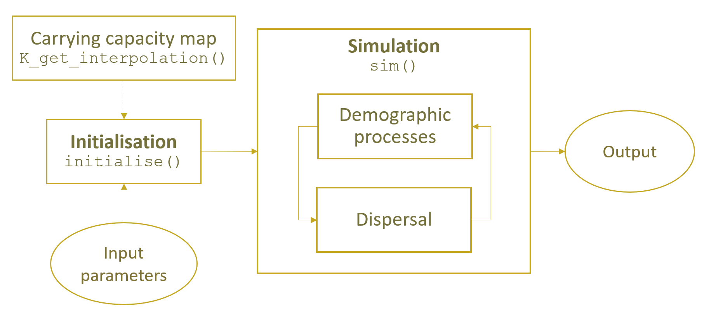

```{r setup, include = FALSE}
knitr::opts_chunk$set(
  collapse = TRUE,
  comment = "#>"
)
library(rangr)
library(terra)

lapply(list.files(system.file("extdata", package = "rangr"), pattern = "sim_", 
                  full.names = TRUE), load, envir = globalenv())
sim_data_01$id <- unwrap(sim_data_01$id)
sim_data_02$id <- unwrap(sim_data_02$id)
sim_data_01$K_map <- unwrap(sim_data_01$K_map)
sim_data_02$K_map <- unwrap(sim_data_02$K_map)

```

# About `rangr`

This vignette shows an example of a basic use of the `rangr` package. The main goal of this tool is to simulate species range dynamics. The simulations can be performed in a spatially explicit and dynamic environment, allowing for projections of how populations will respond to e.g. climate or land use changes. Additionally, by implementing various sampling methods and observational error distributions, it can accurately reflect the structure of original survey data or simulate random sampling.

```{r diagram, echo = FALSE, out.width = '70%', fig.cap="rangr structure", fig.align='center'}
# 
```

Here, we showcase the full capabilities of our package, from creating a virtual species to performing simulation and visualization of results.

# Basic workflow

In this chapter we will show you how to perform basic simulation using maps provided with the package.

## Installing the package

First we need to install and load the `rangr` package.

```{r load_rangr, eval = FALSE}
# install.packages("rangr")
library(rangr)
```

Since the maps in which the simulation takes place have to be in the `SpatRaster` format, we will also install and load the `terra` package to facilitate their manipulation and visualisation.

```{r load_raster, eval = FALSE}
# install.packages("terra")
library(terra)
```

## Input maps

One of the most important input parameters for simulation are maps specifying the abundance of the virtual species at the starting point of the simulation and carrying capacity of environment in which simulation takes place. In this section, we will not generate them from scratch. Instead, we will use maps provided with the package.

Example maps available in rangr:

-   `n1_small.tif`
-   `n1_big.tif`
-   `K_small.tif`
-   `K_small_changing.tif`
-   `K_big.tif`

You can find additional information about these data sets in help files:

```{r help_input_maps, eval=FALSE}
?n1_small.tif
?K_small.tif
```

We will use these two datasets right now:

-   `n1_small.tif` - as abundance at the starting point,

-   `K_small.tif` - as carrying capacity.

To read the data we can use `rast` function from the `terra` package:

```{r load_input_maps}
n1_small <- rast(system.file("input_maps/n1_small.tif", package = "rangr"))
K_small <-  rast(system.file("input_maps/K_small.tif", package = "rangr"))
```


Since both of these maps refer to the same virtual or in this case real environment (a small region located in northwestern Poland), they must have the same dimensions, resolution, geographical projection etc. The only differences between them may be the values they contain and the number of layers. You can use multiple layers in the carrying capacity map to create a dynamic environment during the simulation, but in this example, we will demonstrate a static environment.

Let's take a closer look at them:

```{r print_maps}
n1_small
K_small
```

Above, you can see the dimensions and other basic characteristics of the sample maps. The only field that differs between these maps is the value field.

Now we will use the `plot` function to visualise input maps to get an even better idea of what we're working with.

```{r fig.align='center', fig.cap="Input maps", message=FALSE, out.width='70%'}
plot(c(n1_small, K_small))
```

Several things are noticeable here:

1.  The shape is the same for both maps, and in both cases, the upper left corner of the map is excluded from the simulation area and is treated as if it were outside the map's extent. To create such an irregular shape, `NA` must be assigned to a particular cell or group of cells.

2.  The initial population is only located in the lower right corner of the simulation area and occupies two cells. Each of them contains 10 individuals (you can use the `values()` function to check).

3.  The carrying capacity map has areas that are unsuitable for the presented virtual species, as well as areas where it can have a positive population growth rate.

## Initialise

Now that we have input maps, we will use the `initialise()` function to set other input parameters and generate a `sim_data` object that will contain all the necessary information to perform a simulation.

The most basic `initialise()` call will look as follows:

```{r initialise, eval=FALSE}
sim_data_01 <- initialise(
  n1_map = n1_small,
  K_map = K_small,
  r = log(2),
  rate = 1 / 1e3
)
```

Let's break down this command:

-   `n1_map` and `K_map` refer to the input maps described earlier.

-   The `r` parameter is used to set the intrinsic population growth rate. The default population growth function is the Gompetz function.

-   The `rate` parameter is related to the `kernel_fun` parameter, which by default is set as an exponential function (`rexp`). Therefore, `rate` determines the shape of the dispersal function.

That way we have determined simulation environment along with demographic processes and dispersal. That’s the most basic set-up needed to perform your first simulation and we will do just that in the next step.

But before that, let’s see what other information `sim_data` contains and what happened behind the scene during initialisation.

First, let’s check the class of `sim_data` object:

```{r class_sim_data_01}
class(sim_data_01)
```

As you can see `sim_data` is a `sim_data` object that inherits from `list` objects so it is possible to change values of this object by hand. However, we strongly encourage you to use `update()` function instead to avoid errors and problems with data integration.

To take a closer look at `sim_data` you can also use `print()` or `summary()` function:

```{r summary_sim_data_01}
summary(sim_data_01)
```

It will show the summary of both input maps, as well as list of other most important parameters such as `r` that we set up earlier.

## Simulation

All you need to perform a simulation is a `sim_data` object and a specified number of time steps that you want to simulate. Additionally, you can use the `burn` parameter to discard a selected number of initial time steps if it makes sense for your research or experiment.

In this first example, we will only set the `time` parameter since we want to observe how our virtual species is dispersing and reproducing.

```{r sim_result_01, eval=FALSE}
sim_result_01 <- sim(obj = sim_data_01, time = 100)
```

Again we will check the class of returned object:

```{r class_sim_result_01}
class(sim_result_01)
```

Similar to `initialise`, `sim` also returns an object that inherits from `list`, but in this case it is called `sim_results`. This list has 3 elements such as:

-   `extinction` - `TRUE` if population is extinct or `FALSE` otherwise

-   `simulated_time` - number of simulated time steps without the burn-in ones

-   `N_map` - 3-dimensional array representing spatiotemporal variability in population numbers. The first two dimensions correspond to the spatial aspect of the output and the third dimension represents time.

The best way to take a closer look at the results is to call a summary function.

```{r summary_sim_result_01, warning=FALSE, fig.align='center', message=FALSE, out.width='70%'}
summary(sim_result_01)
```

It gives you a quick and easy overview of the simulation results by providing simulation time, extinction status and summary of all maps with abundances. It also produces a plot that can be useful to determine the value for `burn` parameter.

## Visualisation

With `rangr` we provided an easy way to visualise chosen time steps from the simulation. To do so you can use the generic plot function:

```{r warning=FALSE, fig.align='center', fig.cap="Abundances", message=FALSE, out.width='70%'}
plot(sim_result_01,
  time_points = c(1, 10, 25, 50),
  template = sim_data_01$K_map
)
```

You can also adjust its parameters to get more breaks on the colorscale:

```{r warning=FALSE, fig.align='center', fig.cap="Abundances", message=FALSE, out.width='70%'}
plot(sim_result_01,
  time_points = c(1, 10, 25, 50),
  breaks = seq(0, max(sim_result_01$N_map + 5, na.rm = TRUE), by = 5),
  template = sim_data_01$K_map
)
```

If you prefer working on raster you can also transform any `sim_result` object into `SpatRaster` using `to_rast()` function:

```{r warning=FALSE, fig.align='center', fig.cap="Abundances", message=FALSE, out.width='70%'}
# raster construction
my_rast <- to_rast(
  sim_result_01,
  time_points = 1:sim_result_01$simulated_time,
  template = sim_data_01$K_map
)

# print raster
print(my_rast)
```

And then visualise it using `plot()` function:

```{r warning=FALSE, fig.align='center', fig.cap="Abundances", message=FALSE, out.width='70%'}
# plot selected time points
plot(my_rast, c(1, 10, 25, 50))
```

# More advanced workflow

The previous workflow was pretty basic. Now we will present a more advanced one and use it to show some of the other parameters options.

## Input maps

### Abundances at the first time step

As we mentioned earlier, `rangr` has the ability to simulate virtual species in a changing environment and in this example we will show you how to do it. For a better illustration, we should start from a more populated map than the previously used `n1_small`. The easiest way to do this is to use abundances from the last time step of the previous simulation as an input for the current one. This can be done as follows: 

```{r new_n1_map}
n1_small_02 <- n1_small
values(n1_small_02) <- (sim_result_01$N_map[, , 100])
```

### Carrying capacity

To simulate changing environment we need to specify the changes that we want. Essentially, you need to have a carrying capacity map for every time step of the simulation. You can generate those by yourself or you can generate maps only for a few key time steps (at least the first and the last one) and then use `K_get_interpolation()` to generate missing ones. Here we will choose the second option and use the `K_small_changing` object that comes with `rangr` for this purpose. Below you can see its summary:

```{r summary_K_small_changing}
K_small_changing <- rast(system.file("input_maps/K_small_changing.tif", 
                                     package = "rangr"))
K_small_changing
```

As you can see the carrying capacity increases in each map, meaning that our environment is becoming more and more suitable for virtual species. It is also worth noting that the first layer of `K_small_changing` is the same as `K_small`. Again, we can visualise all input maps using `plot` function:

```{r fig.align='center', fig.cap="Input maps", message=FALSE, out.width='70%'}
plot(c(n1_small_02, K_small_changing),
     range = range(values(c(n1_small_02, K_small_changing)), na.rm = TRUE),
     main = c("n1", paste0("K", 1:nlyr(K_small_changing))))
```

This raster has 3 layers so we can either perform a simulation with only 3 time steps (which seems rather pointless) or, as mentioned, use `K_get_interpolation()` function to generate maps for each time step. In this example, we will perform 200 time steps so we will need 200 maps.

The first and the last layers from `K_small_changing` are corresponding to the first and last time steps and the middle one can be assigned to any time step in between. Additionally, to give our virtual species some time to adjust to the new parameters, first few carrying capacity maps will be the same. To do so we will duplicate the first layer of `K_small_changing`. Therefore, the layers and corresponding time points will be as follows:

-   1st layer of `K_small_changing` - 1st time step,

-   duplicated 1st layer of `K_small_changing` - 20th time step,

-   2nd layer of `K_small_changing` - 80th time step,

-   3rd layer of `K_small_changing` - 200th time step.

This translates into a stable environment during 1-20 time steps, rapidly increasing carrying capacity during 20-80 time steps and slowly rising carrying capacity during 80-200 time steps.

```{r K_get_interpolation}
# duplicate 1st layer of K_small_changing
K_small_changing_altered <- c(K_small, K_small_changing)

# interpolate to generate maps for each time step
K_small_changing_interpolated <- K_get_interpolation(
  K_small_changing_altered, 
  K_time_points = c(1, 20, 80, 200))
K_small_changing_interpolated
```
```{r fig.align='center', fig.cap="Interpolation results", message=FALSE, out.width='90%'}
# visualise results
vis_layers <- c(1, 20, 30, seq(50, 200, by = 20), 200)
plot(subset(K_small_changing_interpolated, subset = vis_layers),
     range = range(values(K_small_changing_interpolated), na.rm = TRUE), 
     main = paste0("K", vis_layers),
)
```

This completes preparation of input maps needed for this example. Now we will select values of other parameters.

## Initialise (using update function)

First let's look again at the `sim_data` object from the previous chapter:

```{r print_sim_data_01}
print(sim_data_01)
```

After information about input maps we can see a list of parameters available to change. We will alter the following ones:

-   `r` - intrinsic growth rate,

-   `r_sd` - intrinsic growth rate stochasticity,

-   `K_sd` - environmental stochasticity,

-   `growth` - growth function of virtual species,

-   `A` - strength of Allee effect,

-   `dens_dep` - what determines the possibility of settling in particular cell,

-   `border` - how borders are treated.

To change these parameters (along with carrying capacity map prepared in the previous section) we could simply initialise new `sim_data` object from scratch. Here we will use `update()` on `sim_data` from the previous example to showcase its use.

```{r update_sim_data_01, eval=FALSE}
sim_data_02 <- update(sim_data_01,
  n1_map = K_small,
  K_map = K_small_changing_interpolated,
  K_sd = 1.1,
  r = log(5),
  r_sd = 0.05,
  growth = "ricker",
  A = 0.2,
  dens_dep = "K",
  border = "reprising",
  rate = 1 / 500
)
```

The growth of virtual species is now defined using the ricker (`growth = "ricker"`) function with increased intrinsic growth rate (`r` `=` `log(5)`) combined with weak Allee effect (`A = 0.2`) and added demographic stochasticity (`r_sd = 0.05`). The probability of settlement in a target cell is determined solely by its carrying capacity value (`dens_dep = "K"`). We also changed the dispersal kernel's parameter (`rate = 1/500`) and the behaviour of the species near the borders - now specimens cannot leave the specified study area (`border = "reprising"`).

```{r print_sim_data_02}
print(sim_data_02)
```

## Simulation

Simulation set-up will be very similar to the previous one. We designed it that way in order to simplify the process of simulation replication. We will also now demonstrate how parallel calculations can be used when running simulations:

```{r sim_result_02, eval=FALSE}
library(parallel)
cl <- makeCluster(detectCores() - 2)

sim_result_02 <- sim(obj = sim_data_02, time = 200, progress_bar = TRUE, cl = cl)

stopCluster(cl)
```

```{r summary_sim_result_02, fig.align='center', out.width='70%'}
summary(sim_result_02)
```

Now the behaviour of created virtual species and the world in which it lives is much more complex than before. As a result, it can better mimic real ecological scenarios that users might want to explore. In this case, we observe a decline in the mean abundance in the first few time steps of the simulation due to a change in parameters from the previous simulation. Then, we see a rapidly increasing trend to catch up to increasing carrying capacity, which slightly slows down later.

## Visualisation

Let's visualise the result of this simulation.

```{r warning=FALSE, fig.align='center', fig.cap="Abundances", message=FALSE, out.width='90%'}
plot(sim_result_02,
  time_points = c(1, 10, seq(20, 200, by = 20)),
  breaks = seq(0, max(sim_result_02$N_map + 5, na.rm = TRUE), by = 20),
  template = sim_data_02$K_map
)
```

